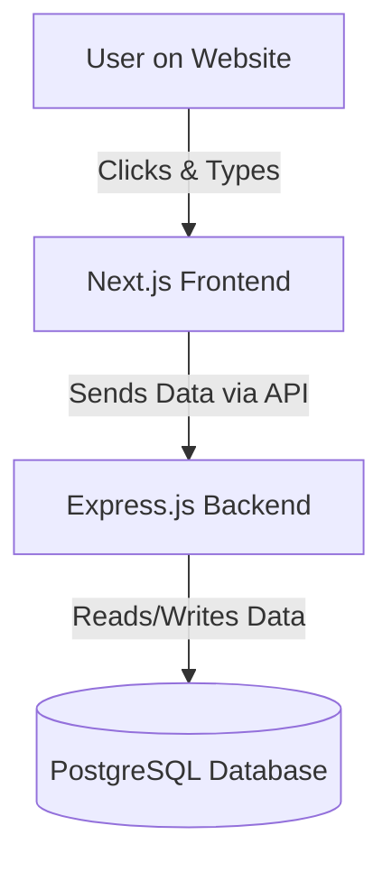

# Simple System Design: Event Manager Dashboard

## 1. What Does This App Do?
The Event Manager Dashboard is a web application that lets organizers create and manage events, and lets attendees sign up for them. 

It is divided into two main parts:
- **Frontend (What the user sees):** Built with Next.js and Tailwind CSS.
- **Backend (The brain and data):** Built with Node.js, Express, and PostgreSQL.

---

## 2. How Everything Connects (Architecture)

Here is a simple diagram showing how data flows when a user interacts with the app:

### The Three Layers:
1. **Frontend Layer:** This is running on Port 3000. It shows the screens, buttons, and forms. When you click "Create Event," it talks to the Backend.
2. **Backend API Layer:** This is running on Port 5000. It receives the request from the Frontend, checks if the data is valid, and then talks to the Database.
3. **Database Layer:** This stores all the permanent information, like the list of events and the people who registered.

---

## 3. Database Design

We are using a **PostgreSQL Database** and we talk to it using raw SQL commands (no ORMs). We have two main tables:

### Table 1: `events`
Stores the actual events.
- `id`: A unique number for the event.
- `name`: The title of the event.
- `description`: Details about the event.
- `date`: When the event happens.
- `location`: Where it happens.

### Table 2: `participants`
Stores the people who sign up for an event.
- `id`: A unique number for the person.
- `event_id`: This links the person to a specific event in the `events` table.
- `name`: The person's name.
- `email`: The person's email.
- `status`: Whether they are going ('active') or cancelled ('cancelled').

*Note: If an event is deleted, all participants linked to that event are automatically deleted too (this is called "Cascading Deletes").*

---

## 4. How the Code is Organized

### Frontend Folder (`/frontend`)
- **Pages:** Handles what shows up on the screen (e.g., the Home Page, the Create Event Page).
- **Components:** Reusable UI pieces like Buttons and Input boxes.
- **API File:** A single file (`api.ts`) that contains all the instructions for how the frontend should talk to the backend.

### Backend Folder (`/backend`)
- **Routes:** Decides where requests should go (e.g., "If someone asks for `/api/events`, go to the event controller").
- **Controllers:** The middleman. It takes the request, asks the Model for data, and sends the answer back to the user.
- **Models:** The only part of the code that actually writes SQL commands to talk to the database.

---

## 5. Deployment (AWS EC2)

When running live on the internet, we put both the Frontend and the Backend on a single server (AWS EC2 instance).

We use a tool called **Nginx**. Nginx acts like a traffic cop. When someone visits your website domain:
- Nginx sends them to the Next.js Frontend.
- If the Frontend needs data from the server, Nginx seamlessly routes that specific request to the Express Backend.
